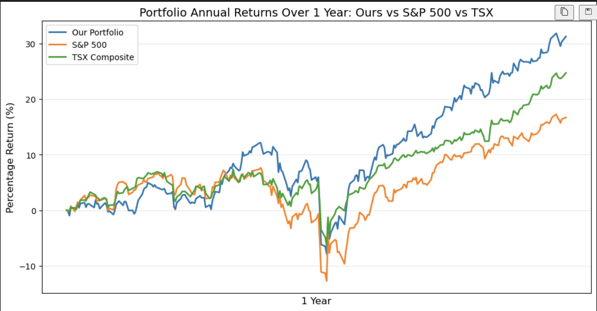
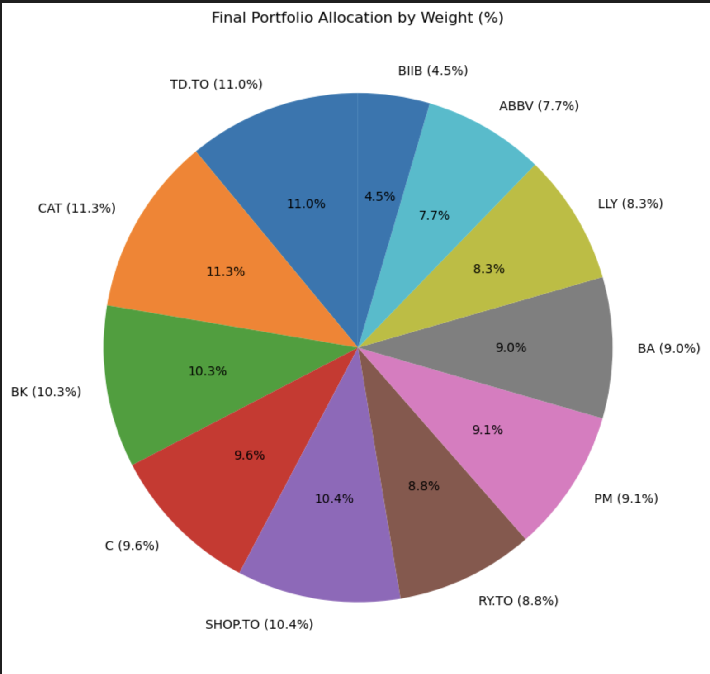
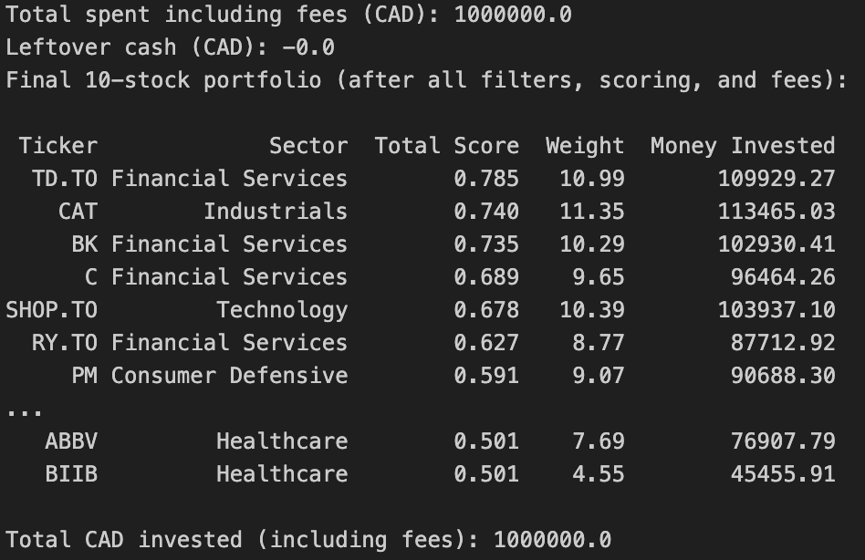

# Market Beat
### Quantitative Portfolio Optimization Engine

**Market Beat** is a Python-based quantitative investing project that constructs a **10-stock, rules-based equity portfolio** using real market data, multi-factor scoring, and realistic trading constraints.

The project is designed to mirror **practical portfolio construction**, not theoretical optimization. It accounts for liquidity, position limits, sector exposure caps, transaction costs, and diversification effects to produce **fully investable portfolios**.

---

## What Market Beat Does

Given a CSV of equity tickers, Market Beat:

1. Cleans and validates the ticker universe  
2. Filters for tradability and liquidity  
3. Computes risk, return, and diversification metrics  
4. Scores stocks using a weighted multi-factor model  
5. Selects **exactly 10 stocks** for the portfolio  
6. Enforces realistic portfolio constraints  
7. Outputs portfolio recommendations, CSV files, and visual diagnostics  

---

## Design Focus: Realistic Constraints & Risk Awareness

Market Beat prioritizes **real-world feasibility and risk control** rather than purely maximizing returns.

Key assumptions:
- Long-only portfolio  
- Fixed capital budget (CAD $1,000,000)  
- Transaction costs included  
- Position and sector limits enforced programmatically  
- Preference for stable, risk-adjusted performance  

---

## Portfolio Rules (Strictly Enforced)

- **Portfolio size:** **10 stocks (fixed)**  
- **Capital:** CAD $1,000,000  
- **Max position size:** 15% per stock  
- **Max sector exposure:** 40% per sector  
- **Sector diversity during selection:** max 4 stocks per sector  
- **Fully invested:** excess weight is redistributed automatically  

---

## Ticker Cleaning & Validation

Before any scoring occurs, Market Beat performs strict input validation:

- Removes duplicates, whitespace issues, invalid symbols, and junk rows  
- Rejects malformed or non-tradable tickers  
- Filters to U.S. and Canadian equities only  
- Ensures sufficient universe size and sector diversity  

If the input universe cannot support a diversified 10-stock portfolio, execution stops with a clear error.

---

## Stock Scoring System

Each stock receives a **Total Score** built from **four normalized components**, each capturing a different dimension of portfolio quality.

### Final Score Weights

| Component | Weight |
|--------|-------:|
| Original Score (risk & quality core) | 0.30 |
| Monte Carlo expected return | 0.30 |
| CAPM expected return | 0.25 |
| Diversification score | 0.15 |

---

## Explanation of the Model & Thought Process

This section explains **why each part of the system exists** and the reasoning behind the design choices.

- **Multi-factor scoring:** No single metric captures stock quality. Combining risk-adjusted performance, theoretical expected return, simulations, and diversification produces more stable portfolios.
- **Normalization:** Metrics are normalized so no component dominates due to scale rather than importance.
- **Hard constraints:** Position and sector caps prevent unrealistic allocations and improve robustness.
- **Monte Carlo simulations:** Forward-looking simulations capture uncertainty beyond historical averages.
- **Diversification scoring:** Penalizes highly correlated stocks to reduce drawdowns and volatility.

---

## Portfolio Construction Logic

1. Rank all stocks by Total Score  
2. Select top candidates while enforcing sector limits  
3. Convert scores into proportional portfolio weights  
4. Enforce the 15% per-stock cap via iterative redistribution  
5. Enforce the 40% sector cap  
6. Apply transaction costs and ensure the portfolio fits within budget  

The final portfolio is **fully investable, constraint-compliant, and interpretable**.

---

## Outputs

Market Beat generates **both data files and visual diagnostics**.

### CSV Outputs
- **Ranked Universe CSV**
  - All computed metrics and scores  
  - Ranking of all eligible stocks  
- **Final Portfolio CSV**
  - 10 selected stocks  
  - Final weights  
  - CAD allocations  
  - Share counts  

These files explicitly show **which stocks to buy and how much to allocate**.

---

## Graphs & Visual Diagnostics

### Portfolio Performance vs Benchmarks
*(Cumulative performance of the optimized portfolio vs S&P 500 and TSX)*



---

### Final Portfolio Allocation
*(Final weight distribution of the 10-stock portfolio)*



---

### Final Portfolio Output
*(Console output showing selected stocks, sectors, weights, and capital allocation)*



---

### Cleaned & Validated Output
*(Cleaned data after ticker validation and preprocessing)*


---

## Requirements

- Python 3.x  
- pandas  
- numpy  
- numpy-financial  
- yfinance  
- matplotlib  

```bash
pip install pandas numpy numpy-financial yfinance matplotlib
```

---

## How to Run

1. Place your ticker CSV in the project directory  
2. Run the script or notebook  
3. Review:
   - CSV outputs  
   - Portfolio selection  
   - Graphs and diagnostics  

---

## Authors

**Saren Sabeskaran**  
**Joey Xu**

---

## Disclaimer

This project is for educational and demonstration purposes only.  
It does not constitute investment advice.
